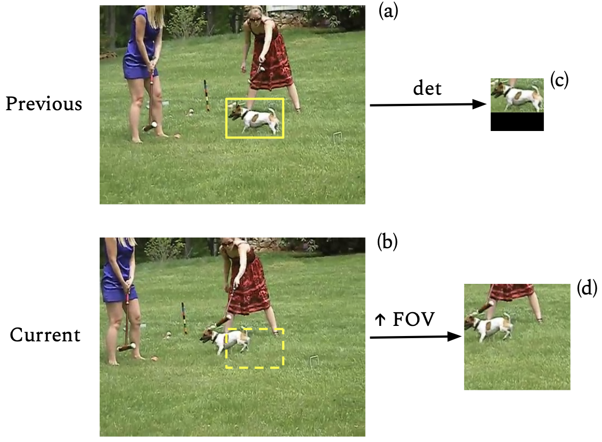
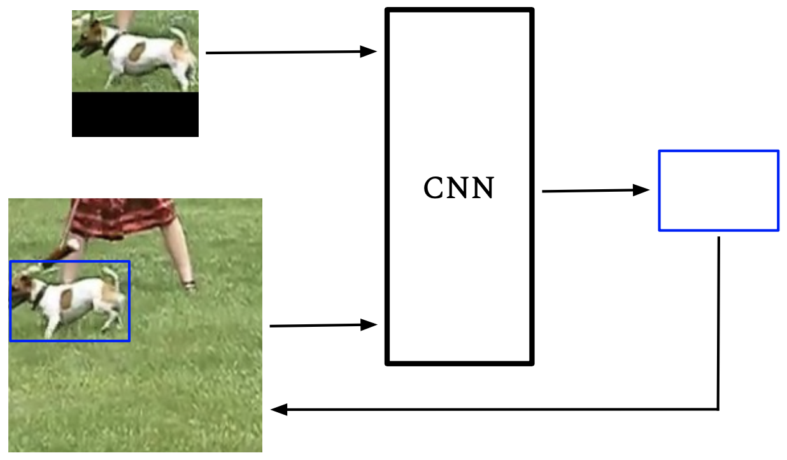
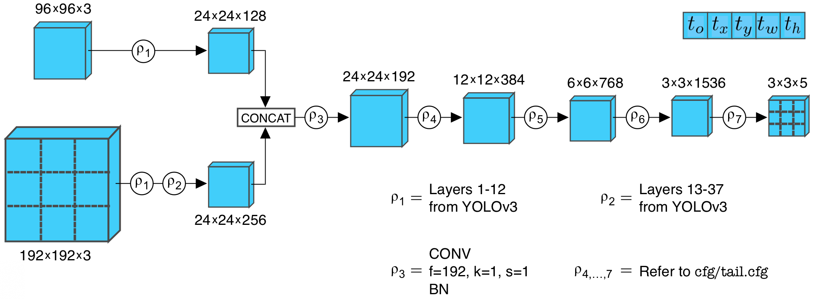
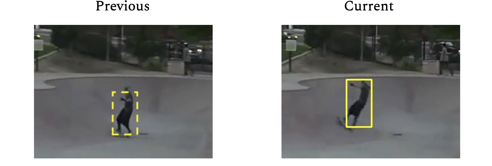
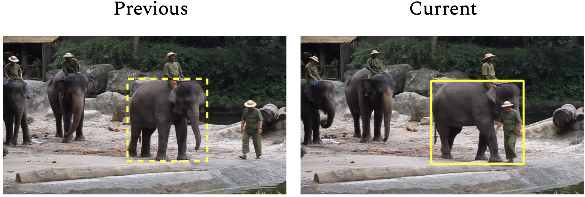

# TrackerNet
TrackerNet performs object tracking using a novel, regression-based convolutional neural network and was designed to be performant even in applications constrained to low frame rates. Given two input frames, the CNN searches for a specified object from the "previous" frame in the "current" frame. The custom CNN architecture is inspired by GOTURN object tracking [1] and YOLO object detection [2]. A short presentation can be found at [bit.ly/tracker-net](https://bit.ly/tracker-net).

## Setup
The Conda environment used for development and test can be obtained by running
```
conda env create -f <yml_file>
```
where `<yml_file>` is either `trackernet.yml` or `trackernet-gpu.yml`.

If one desires to perform training, the following are required:  Instead, describe what `./init.sh` downloads (change due to model having to go on Google Drive.

1. YOLO weights. These are used to initialize the parameters in the "head" of the CNN architecture (more on this in the Overview section).
2. [TrackingNet](https://github.com/SilvioGiancola/TrackingNet-devkit) dataset. The entire dataset is not required. In fact, TrackerNet is currently trained on a subset of the dataset, including TRAIN_0, TRAIN_1, TRAIN_2, and TRAIN_3. Describe skip every 5
3. Because the CNN requires two input images per forward pass, a file is needed to manage the associations. A JSON file was used to group adjacent frames of TrackingNet.

Running `./init.sh` downloads (a) open-source YOLO parameters and (b) the specific dataset used during development to `data/` (requirements 1 and 3 above).

Alternatively, 

## Overview
Figs. 1 and 2 show a conceptual depiction of TrackerNet. As shown in Fig. 1, tracking is performed on a "previous" and "current" frame. Given an object specified in the "previous" frame by a bounding box, the algorithm searches for it in the "current" frame. Rather than looking at the entirety of the "current" frame for the desired object, a preprocessing step retrieves a subset of the frame with an increased field of view (FOV). TrackerNet is currently implemented such that the subset of the "current" frame has twice the FOV of the cropped image represented by Fig. 1(c). Ultimately, the images represented by Fig. 1(c) and 1(d) are passed as inputs to the CNN.

<div align="center">
  <p></p>
  <p>Fig. 1: Given two input frames, the images represented <br/>by (c) and (d) are passed as inputs to the CNN.</p>
</div>

Finally, the parameters at the output of the CNN describe the bounding box for the object in the "current" frame if it is still present.

<div align="center">
  <p></p>
  <p>Fig. 2: Output of CNN describes the bounding box<br/>for the desired object in the "current" frame.</p>
</div>

## Model Architecture
The TrackerNet architecture is shown in Fig. 3. The "head" is defined by the operations prior to the concatenation operation and . Conversely, the tail 

<div align="center">
  <p></p>
  <p>Fig. 3: Custom, regression-based CNN architecture.</p>
</div>

Config file

## Training
As mentioned in the Setup section, `./init.sh` downloads `data_train.json`, `data_val.json`, and `data_test.json` to `data/`. Because a user may not require all of TrackingNet's TRAIN_0, ..., TRAIN_3 for training, `src/trackingnet_local.py` is used to create JSONs that correspond to the user's local copy of TrackingNet (outputting, for example, `data_train_local.json`). This also gives a user the opportunity to specify the absolute path to their local copy of TrackingNet. Run
```
python src/trackingnet_local.py <abs_path>
```
where `<abs_path>` is the absolute path to the TrackingNet directory.

Training can then be performed by running
```
python src/trackernet_train.py <cfg_head> <cfg_tail>
```
where `<cfg_head>` and `<cfg_tail>` are text files (refer to `cfg/head.cfg` and `cfg/tail.cfg`). Note that `<cfg_head>` is expected to contain the model hyperparameters. Checkpoints are saved to the `model/checkpoints` directory.


## Inference
Inference can be performed by running
```
python src/trackernet_inference.py <model_file> <json_file>
```
`<model_file>` is expected to be a .h5 saved Keras model, and `<json_file>` must be a JSON file that contains paths to two images and a bounding box for the object to track from the first image. See `data/elephant_inference.json` and `data/skater_inference.json` for examples of the expected formatting.

## Improvements
Given the exploratory and time-constrained nature of this project, fine-tuning of hyperparameters and the model architecture is pending. As far as the CNN "head", it's not immediately clear at what spatial resolution concatenation should occur. Moreover, the current model uses a 1-by-1 kernel immediately after concatenation to compress the depth of the resultant tensor; this could prove to be a bottleneck but is a convenient way to reduce the number of learnable parameters. Similarly, the specific operations comprising the "tail" of the CNN need to be optimized.

TrackingNet is made up of a wide range of objects and corresponding geometries, including humans, dogs, canoes, elephants, emergency vehicles, and more. When faced with varying object geometries, recent object detectors have resorted to using appropriately-sized anchor boxes. Correspondingly, it's expected that TrackerNet performance would be improved with appropriately-sized anchors. Presently, TrackerNet simply uses a fixed 96-by-96 anchor box.

The training data presently used was created by grouping every fifth frame (every ~0.17 sec) in TrackingNet. The motivation was that grouping consecutive frames would result in minimal variation between the "previous" and "current" frame. Conversely, sampling more sparsely could result in objects outside of the FOV of the "current" frame. Improvements may be attainable by curating a dataset that specifically includes occlusions, lighting changes, etc, rather than the somewhat arbitrary grouping used presently.

Finally, when cropping the "previous" image, it may be beneficial to include slightly more pixels than the crop obtained by directly using the corresponding bounding box. Doing so may reduce loss of information at the image borders caused by the convolution operations.

## Results
Below are preliminary results of the trained model. Note that despite rotation of the skateboarder, the model is able to track it.

<div align="center">
  <p></p>
  <p>Fig. 4: Skateboarder is tracked despite considerable rotation.</p>
</div>

In the image below, note that the elephant has progressed considerably through the capture and is occluded by a human. Despite this, the model continues to be able to track it.

<div align="center">
  <p></p>
  <p>Fig. 5: Elephant is tracked despite occlusion and rotation.</p>
</div>

## Customization
TrackerNet was designed such that the "current" image input crop has a FOV that is twice that of the "previous" image input crop. Certain applications may benefit from a different FOV multiple. For instance, applications in which FPS rates are extremely low or objects move quickly, the FOV multiple may need to be increased. Note that due to the nature of convolution operations, it's most convenient for the FOV multiple to be a multiple of 2.

## References
[1] [Learning to Track at 100 FPS with Deep Regression Networks, D. Held et al., 2016](https://arxiv.org/pdf/1604.01802.pdf)

[2] [YOLOv3: An Incremental Improvement, J. Redmon et al., 2018](https://arxiv.org/pdf/1804.02767.pdf)

